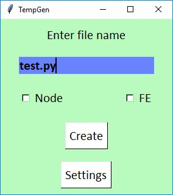
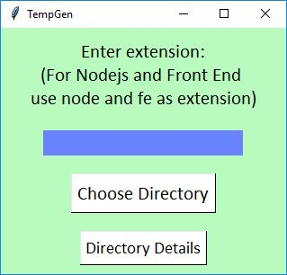
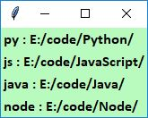

# TempGen
In TempGen user can specify the directory in which they want to store a file written in a specific language. 
Thereafter the files get stored in the specified directory rather than manually navigating. 
TempGen also provides template for Front End Web Development and Nodejs.

Enter File Name and click on Create. File will be created in appropriate directory.

Settings Window

Directory Details

